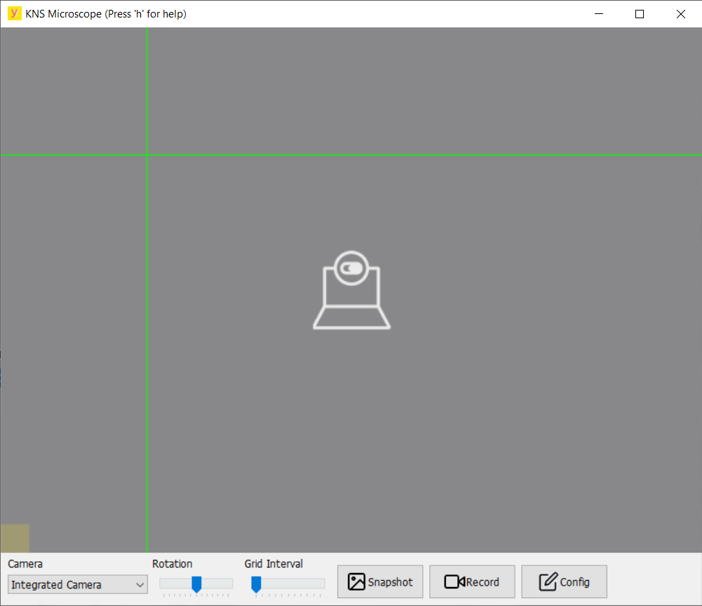
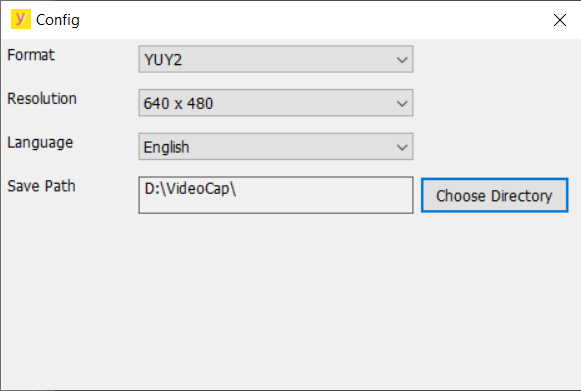
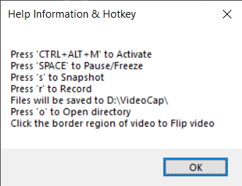
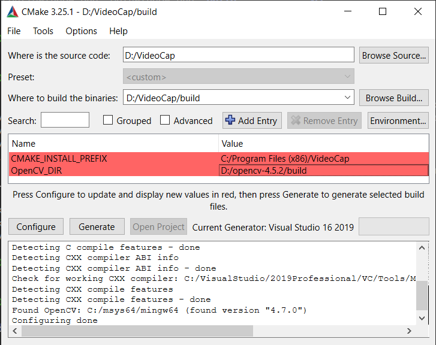

# Table of Contents

1.  [Change logs](#orgd98e961)
    1.  [Version 1.5](#org7856fe7)
    2.  [Version 1.4](#org8074a7f)
    3.  [Version 1.3](#orgb390a0f)
    4.  [Version 1.2](#org83ebe1e)
    5.  [Version 1.1](#org1bf9c2f)
2.  [Overview](#org3ddfae1)
3.  [Toolbar](#org7a2cea6)
4.  [Config Window](#orgc8bd1f6)
5.  [Help Window](#org5d4f3d1)
6.  [Other Functionality](#orgacd7091)
7.  [CPU and Memory usage](#org1aa2d24)
8.  [How to Build](#orghowtobuild)
8.  [Make Installer](#orgmakeinstaller)

# Change logs

## Version 1.5

1.  add help message box and config popup window
2.  add maximize and minimize boxes to main window
3.  add hotkeys
4.  add grid trackbar
5.  support video flip

## Version 1.4

1.  supported image rotation

## Version 1.3

1. fixed crash when work with 'Matrox Capture' on Power-C
2. limited resolution (too big resolution result in out of display area)
3. added comand line option 'console' for print debug infomation

## Version 1.2

1.  fixed crash when no device available
2.  refined UI
3.  supported Chinese language
4.  fixed the displaying stucked problem happened somtimes after switching device

## Version 1.1

1.  added a json config file
2.  removed all command line options
3.  used MP4 insteaded of AVI
4.  supported hardware snap button
5.  solved memory leaking problem
6.  solved window painting problem

# Overview

This application captures video from any video device which can be recognized by Windows OS. User can rotate, flip video and draw grid on video. User can also snapshot images and record videos.

Main Window

Cofig Window

Help Window

# Toolbar

There is a toolbar at bottom of main window. Blew table describes each toolbar item in detail.

<table border="2" cellspacing="0" cellpadding="6" rules="groups" frame="hsides">

<colgroup>
<col  class="org-left" />

<col  class="org-left" />
</colgroup>
<tbody>
<tr>
<td class="org-left">Toolbar Item</td>
<td class="org-left">Description</td>
</tr>

<tr>
<td class="org-left">Camera Combo Box</td>
<td class="org-left">Select a camera to play</td>
</tr>

<tr>
<td class="org-left">Rotation Trackbar</td>
<td class="org-left">Rotate video from -180 degree to 180 degree, every 10 degree a step</td>
</tr>

<tr>
<td class="org-left">Grid Interval Trackbar</td>
<td class="org-left">Draw grid on video, grid interval from 0 (None) to 500 pixel,</td>
</tr>

<tr>
<td class="org-left">&#xa0;</td>
<td class="org-left">every 5 pixel a step</td>
</tr>

<tr>
<td class="org-left">Snap Button</td>
<td class="org-left">Click to snapshot a JPEG picture</td>
</tr>

<tr>
<td class="org-left">Record Button</td>
<td class="org-left">Click to record a MP4 video</td>
</tr>

<tr>
<td class="org-left">Config Button</td>
<td class="org-left">Show Config Window</td>
</tr>
</tbody>
</table>

# Config Window

There are 4 config item on Config Window. Blew table describes each config item in detail.

<table border="2" cellspacing="0" cellpadding="6" rules="groups" frame="hsides">

<colgroup>
<col  class="org-left" />

<col  class="org-left" />
</colgroup>
<tbody>
<tr>
<td class="org-left">Config Item</td>
<td class="org-left">Description</td>
</tr>

<tr>
<td class="org-left">Format</td>
<td class="org-left">Camera may support several formats, compressed format like MJPG</td>
</tr>

<tr>
<td class="org-left">&#xa0;</td>
<td class="org-left">cost more CPU time but less memory</td>
</tr>

<tr>
<td class="org-left">Resoluton</td>
<td class="org-left">Camera may support several resolutons, lower than 640X480 will be skipped,</td>
</tr>

<tr>
<td class="org-left">&#xa0;</td>
<td class="org-left">higher resoluton cost more CPU time and memory</td>
</tr>

<tr>
<td class="org-left">Language</td>
<td class="org-left">Chinese and English are supported</td>
</tr>

<tr>
<td class="org-left">Save Path</td>
<td class="org-left">Directory for saving image and video files, default path is D:/VideoCap</td>
</tr>
</tbody>
</table>

# Help Window

 This application support a set of hotkeys. They are use for when the main window is maximized (toolbar is hided) or the window is at backgroud. Press 'h'
to show the Help Window for detail information. Also blew table describes each hotkey in detail.

<table border="2" cellspacing="0" cellpadding="6" rules="groups" frame="hsides">

<colgroup>
<col  class="org-left" />

<col  class="org-left" />
</colgroup>
<tbody>
<tr>
<td class="org-left">Hotkey</td>
<td class="org-left">Description</td>
</tr>

<tr>
<td class="org-left">CTRL+ALT+M</td>
<td class="org-left">Make this appliction foreground and active</td>
</tr>

<tr>
<td class="org-left">s</td>
<td class="org-left">The same as click Snap Button</td>
</tr>

<tr>
<td class="org-left">r</td>
<td class="org-left">The same as click Record Button</td>
</tr>

<tr>
<td class="org-left">SPACE</td>
<td class="org-left">Freeze/Pause the video</td>
</tr>

<tr>
<td class="org-left">o</td>
<td class="org-left">Open the Save Path in Window Explorer</td>
</tr>

<tr>
<td class="org-left">h</td>
<td class="org-left">Popup help infomation</td>
</tr>
</tbody>
</table>

Note that only CTRL+ALT+M is registered to OS, other hotkeys need focus on Main Window.

# Other Functionality

1.  The status of application is saved in a json file when application exits. It is stored at the same directory of the executable.
2.  Camera may has a real push button, it is also support by this application, if pressed a BMP file will be saved.
3.  Click the left or right border region of video to flip video horizontally, top or bottom to flip vertically.

# CPU and Memory usage

If using compressed format like MPEG, more CPU resources is needed but less memory resources. Blow is two statistics based on experiment with Version 1.3.

<table border="2" cellspacing="0" cellpadding="6" rules="groups" frame="hsides">

<colgroup>
<col  class="org-left" />

<col  class="org-left" />

<col  class="org-left" />

<col  class="org-right" />

<col  class="org-left" />
</colgroup>
<tbody>
<tr>
<td class="org-left">Device Name</td>
<td class="org-left">Format</td>
<td class="org-left">Resolution</td>
<td class="org-right">AVG CPU</td>
<td class="org-left">AVG Memory</td>
</tr>

<tr>
<td class="org-left">Intergrated Camera</td>
<td class="org-left">MJPG</td>
<td class="org-left">640 x 480</td>
<td class="org-right">3%-4%</td>
<td class="org-left">25 MB</td>
</tr>

<tr>
<td class="org-left">Intergrated Camera</td>
<td class="org-left">YUY2</td>
<td class="org-left">640 x 480</td>
<td class="org-right">2%-3%</td>
<td class="org-left">31 MB</td>
</tr>
</tbody>
</table>

# How to Build

1. Download OpenCV 4.5.2 and decompress it to a directory like `E:/opencv-4.5.2`
2. Run cmake and configure OpenCV_DIR with the directory path
3. Generate VS2019 project with cmake to directory "build\"
4. Open the project and start building

Besides OpenCV 4.5.2, this project also rely on openh264 1.8.0 for saving MP4 with H.264 codec. All the dependence DLLs are put at directory 3rdDLL

# Make Installer

1. make sure the project is built and VideoCap.exe exists at build\Release\
2. run make_installer.bat, then a 7z sfx installer "videocap_installer.exe" will be create at project root
